Solución: Tarea Colaborativa Módulo 6

# 🛡️ El Arsenal del Analista : escáneres de vulnerabilidades.

**Objetivo**: Conocer y ejecutar el escaneo de vulnerabilidades mediante las
herramientas: Tenable Nessus Professional y Nexpose / InsightVM.

## HERRAMIENTAS

### 1\. TENABLE NESSUS PROFESSIONAL.

**URL de descarga / sitio oficial:**
[https://es-la.tenable.com/products/nessus/nessus-professional](https://netcat.sourceforge.net/)

**Tipo de herramienta:** Escáner de vulnerabilidades.

### 1.1. Descripción de la herramienta: 
Nessus es un escáner de vulnerabilidades que identifica y evalúa puntos débiles en sistemas, aplicaciones y dispositivos para prevenir ciberataques. Sirve para realizar auditorías de seguridad, detectar configuraciones incorrectas, malware y otra clase de amenazas que podrían ser explotadas por atacantes.

### 1.2. Usos de la herramienta:

-   **Detección de vulnerabilidades:** Identifica vulnerabilidades conocidas en sistemas operativos, aplicaciones web y otros dispositivos.
-   **Auditoría de configuración:** Verifica que los sistemas estén configurados de manera segura y detecta configuraciones incorrectas. 
-   **Identificación de malware:** Puede detectar la presencia de malware en sistemas operativos Windows y de la familia Unix.
-   **Reducción de la superficie de ataque:** Ayuda a las organizaciones a reducir los posibles puntos débiles en una red.
-   **Cumplimiento normativo:** Permite a las empresas garantizar que sus sistemas cumplen con los estándares de seguridad requeridos.
-   **Detección de datos confidenciales:** Puede descubrir la ubicación de datos sensibles dentro de la infraestructura.
-   **Seguridad en la nube:** Es capaz de escanear y asegurar la infraestructura en la nube de una organización.

### 1.3. Cómo funciona.
Nessus realiza escaneos utilizando una base de datos de complementos (**plugins**) que se actualiza constantemente con la información de las últimas vulnerabilidades descubiertas. El proceso es el siguiente: 

1.  **Configuración del escaneo**: El usuario define el objetivo (una dirección IP o un rango de direcciones) y el tipo de escaneo que desea realizar.
2.  **Ejecución del escaneo**: Nessus sondea los sistemas objetivo para detectar los puertos abiertos y los servicios que se están ejecutando.
3.  **Detección de vulnerabilidades**: Compara la información recopilada con su base de datos de complementos para identificar problemas de seguridad.
4.  **Generación de informes**: Tras el análisis, el programa crea un informe detallado con los hallazgos, la severidad y las recomendaciones para remediar cada vulnerabilidad.

### 1.4. Ejecución de escaneo con Nessus Professional.
Para la ejecución de las pruebas de escaneo de vulnerabilidades se ha utilizado Tenable Nessus Professional instalado en una maquina virtual con Kali.

### Escenario 1. Escaneo sencillo de maquina virtual Metasploitable.
Nessus cuenta con varias plantillas para realizar escaneos (agrupadas en: Discovery, Vulnerabilities and Compliance).

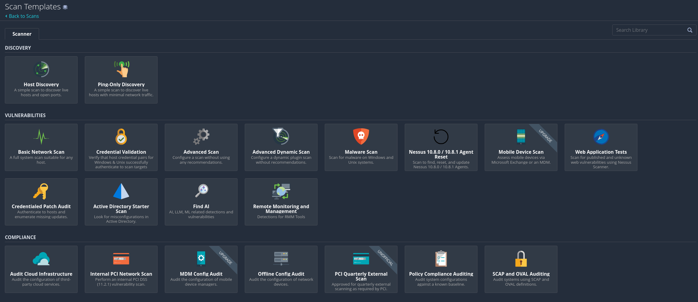

Para esta prueba se ha utilizado el Template "**Host Discovery**" (identifica los sistemas activos en una red, se recomienda como paso previo al escaneo avanzado -- escenario 2) dentro de Discovery, en este caso concreto realiza un escaneo simple para descubrir los puertos abiertos de un Host especifico: 192.168.1.38.

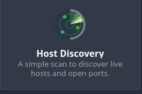

**Paso 1.** ****Configuración del escaneo****: Se define el objetivo, su configuración es muy sencilla, permitiendo solo definir datos genéricos y la IP o rango de IPs. Muestra dos pestañas: Settings y Plugins.

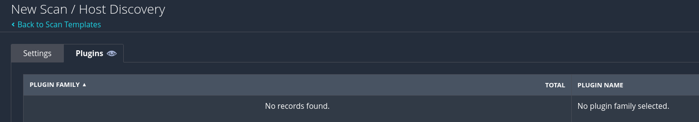

En la sección de **Settings**, permite ingresar los datos necesarios para definir/guardar el escaneo: Nombre, Descripción y Carpeta donde guardar el escaneo, y la IP(s) del Objetivo (se puede especificar una IP, rango de IP, o dominio). En la sección de **Plugins** no muestra ninguno.

**Paso 2. **Ejecución del escaneo****: Nessus escanea los sistemas/equipos objetivo para detectar los puertos abiertos y los servicios que se están ejecutando.

**Paso 3. **Detección de vulnerabilidades****: Internamente compara la información recopilada con su base de datos de complementos para identificar problemas de seguridad.

**Paso 4. Generación de informes:** Como resultado del resumen del escaneo se obtiene la Información del Host, vulnerabilidades y el histórico de escaneos. Con respecto al Host se muestra la IP y los puertos abiertos.

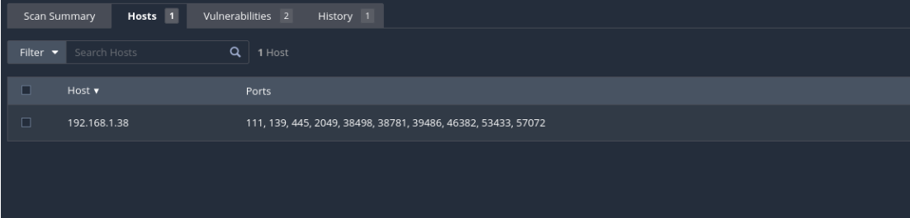

Con respecto a las Vulnerabilidades, se muestra la severidad (Critical, High, Medium, Low e Info), el nombre de la vulnerabilidad, la familia de la vulnerabilidad (Settings, Port scanners) y la cantidad de las vulnerabilidades. De manera complementaria en el lado derecho se muestra el detalle del escaneo concreto:

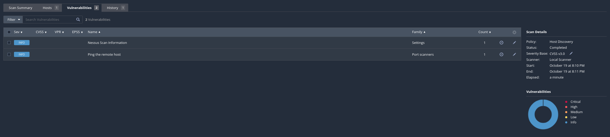

### Escenario 2. Escaneo de Vulnerabilidades de maquina virtual Metasploitable.

Para esta prueba se ha utilizado el Template "**Advanced Scan**" (se enfoca en encontrar vulnerabilidades detalladas, se suele ejecutar luego de haber identificado los host objetivos) dentro de Vulnerabilities, realiza un escaneo de vulnerabilidades mediante el uso de diversos Plugins (predefinidos) para los puertos y servicios. En este caso concreto los Hosts destino para este ejemplo y se ha mantenido las definiciones por defecto en las siguientes opciones de configuración.

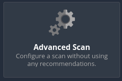

**Paso 1.** **Configuración del escaneo**: Se define el objetivo, se define la IP o rango de IPs.

Se establecen parámetros para el escaneo, como las credenciales para autenticarse en los sistemas y las plantillas de escaneo. Muestra 4 pestañas que pueden ser completadas para una configuración personalizada y avanzada de los siguientes apartados: Settings, Credentials, Compliance y Plugins.

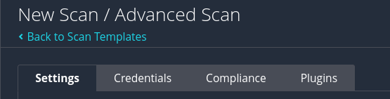

En la sección de **Settings**, permite ingresar los datos necesarios para definir / guardar el escaneo: Nombre, Descripción y Carpeta donde guardar el escaneo, y la IP(s) del Objetivo (se puede especificar una IP, rango de IP, o dominio).

En la sección de **Credentials**, muestra las categorías: Host, API Gateway, Cloud Services, Database, Miscellaneous y Plaintext Autentication. Y según el servicio permite definir el método, y datos de acceso correspondienrte.

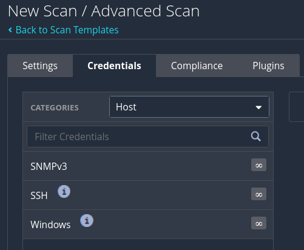

En la sección de **Compliance**, muestra las verificaciones de configuración que se ejecutan en un escaneo para determinar si un host cumple con los estándares de seguridad y las mejores prácticas de la industria, como PCI, CIS, HIPAA, entre otras. Estas auditorías de cumplimiento verifican la configuración del sistema y reportan los resultados como \"pasó\", \"advertencia\" o \"falló\" para ayudar a las organizaciones a asegurar la integridad y el cumplimiento de las normativas.

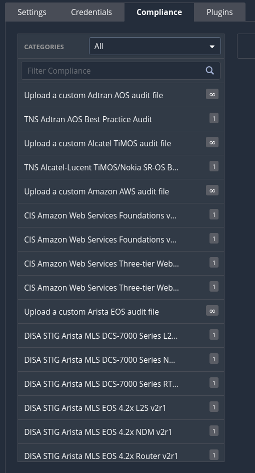

En la sección de **Plugins**, muestra la lista de Plugin que se utilizarán en el escaneo. Los Plugins son pequeños programas que contienen información y algoritmos para detectar vulnerabilidades de seguridad específicas en los sistemas. Cada Plugin se enfoca en una vulnerabilidad concreta, como la Log4Shell o la PrintNightmare, y proporciona las instrucciones que Nessus necesita para identificar su presencia y proporcionar los detalles técnicos.

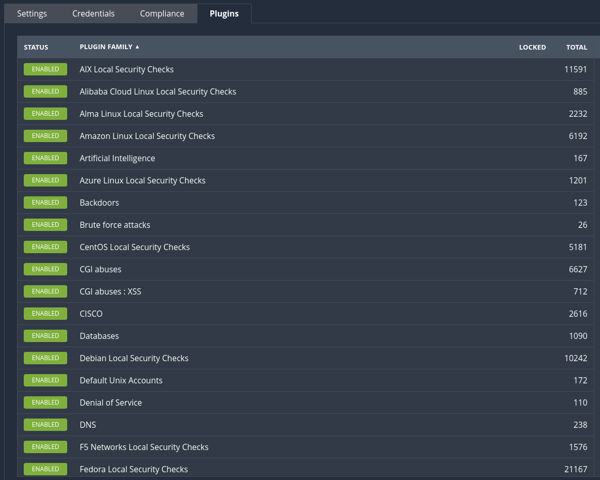

**Paso 2.** **Ejecución del escaneo:** Escanea los sistemas objetivo tomando en cuenta toda la configuración definida en el paso previo de configuración mediante la información registrada en las 4 pestañas antes mencionadas (Settings, Credentials, Compliance y
Plugins). Para este caso concreto no se han especificado credenciales y se ha mantenido la configuración por defecto.

**Paso 3.** **Detección de vulnerabilidades**: Mediante el uso de plugins (scripts específicos) identifica vulnerabilidades conocidas, configuraciones incorrectas y parches faltantes.

**Paso 4. Generación de informes:** Como resultado del resumen del escaneo se obtiene una visión general de los resultados, incluyendo el host escaneado, el número de vulnerabilidades detectadas (49), y una clasificación de esas vulnerabilidades por severidad (crítico (6), alto (5), medio (23), bajo (8) e informativo).

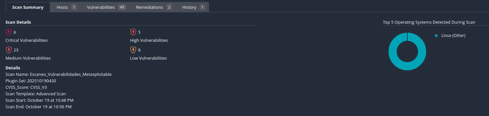

También a nivel de Hosts, se puede apreciar de manera gráfica el total de vulnerabilidades según la severidad diferenciada por colores y el número concreto respectivamente:

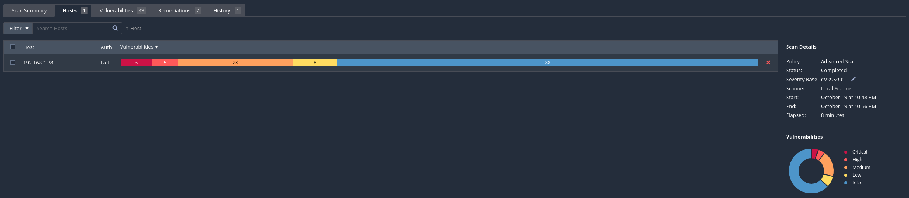

Con respecto a las Vulnerabilidades se aprecia:

-   La severidad (**Crítico:** vulnerabilidades más graves, que representan el mayor riesgo. **Alto:** vulnerabilidades que suponen un riesgo significativo. **Medio:** vulnerabilidades que suponen un riesgo moderado. **Bajo:** vulnerabilidades de menor riesgo. **Informativo:** información no considerada como una vulnerabilidad, pero que puede ser relevante para el análisis de seguridad.
-   **CVSS** (sistema de puntuación de vulnerabilidades comunes - estándar abierto para calificar la gravedad de las vulnerabilidades de seguridad en el software), 
-   **VPR** (indice de priorización de vulnerabilidades - sistema para clasificar la gravedad de las vulnerabilidades de seguridad y priorizar su corrección), 
-   **EPSS** (sistema de puntuación de predicción de exploits - modelo estadístico que predice la probabilidad de que una vulnerabilidad de seguridad sea explotada en los próximos 30 días), 
-   nombre, cada vulnerabilidad detectada en un escaneo de Nessus tiene un nombre específico y único que la identifica 
-   familia (familias de plugins relacionados por ejemplo sistemas operativos, como \"Windows : Parches perdidos\") o aplicaciones (como \"Bases de datos\") y
-   cantidad (recuento de las vulnerabilidades descubiertas en los resultados del escaneo)

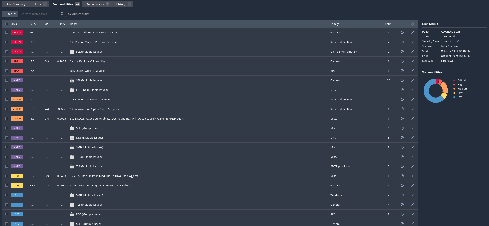

Para cada una de las vulnerabilidades se puede acceder al detalle correspondiente: incluye un informe detallado con información sobre cada vulnerabilidad, como su descripción, gravedad, recomendaciones para mitigarlas y, a veces, datos de exploits disponibles.

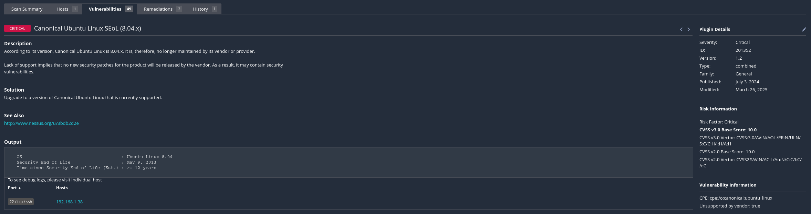

En caso de Vulnerabilidades agrupadas también se puede acceder al detalle correspondiente a cada una de ellas. 

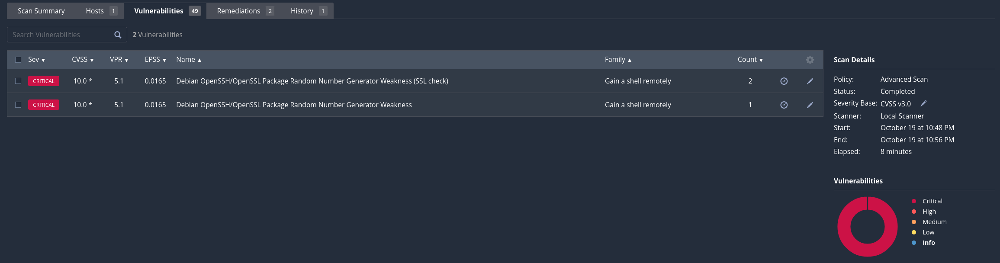

En el lado derecho para cada Vulnerabilidad (Scan Details) incluye mayor información por ejemplo en una de ellas se describe que: una **vulnerabilidad crítica** detectada es la identificada como **CVE-2008-0166.** 

### Resumen general

-   **Severidad:** Crítica (puede comprometer totalmente el sistema afectado).
-   **Tipo:** Remote shell gain, significa que un atacante puede **obtener acceso remoto al sistema**, incluso controlarlo.
-   **ID del plugin:** 32321
-   **Versión:** 1.27
-   **Publicado:** 15 de mayo de 2008
-   **Última modificación:** 16 de noviembre de 2020

### Detalles técnicos

-   **CVSS v2 Base Score:** 10.0 (la puntuación más alta posible - riesgo extremo).

-   **Vector CVSS:** AV:N/AC:L/Au:N/C:C/I:C/A:C

    -   Se puede explotar **a través de la red**
    -   **Baja complejidad** (fácil de explotar)
    -   **No requiere autenticación**
    -   Impacta completamente en **confidencialidad, integridad y disponibilidad.**

-   **Exploit disponible:** Sí (ya existen herramientas que aprovechan esta vulnerabilidad).

-   **Tipo de explotación:** Remota y funcional (ya demostrada en la práctica).

### Información de riesgo

-   **VPR (Vulnerability Priority Rating):** 5.1 prioridad media para parchear, según contexto actual.
-   **EPSS (Exploit Prediction Scoring System):** 0.0165 baja probabilidad de que sea explotada activamente hoy.
-   **Edad de la vulnerabilidad:** más de 2 años (antigua, pero grave si el sistema sigue vulnerable).
-   **CWE-310:** hace referencia a fallos en la **gestión de criptografía.**
-   **CVE-2008-0166:** vulnerabilidad conocida en el generador de claves de OpenSSL (afectaba especialmente a Debian y derivados).

En conclusión lo que se puede interpretar es que: esta vulnerabilidad es **muy antigua pero crítica**. Permite a atacantes **obtener acceso remoto completo** debido a un **error en la generación de claves criptográficas débiles** (principalmente en Debian/Ubuntu en 2008).

Por tanto este equipo, está **en grave riesgo de ser comprometido remotamente**.

Finalmente, con respecto a las Remediations para el CVE antes mencionado por ejemplo sería:

-   Actualizar OpenSSL y regenerar claves.
-   Revocar y reemplazar claves públicas comprometidas.
-   Verificar si las claves son débiles.
-   Revisar sistemas antiguos o imágenes heredadas

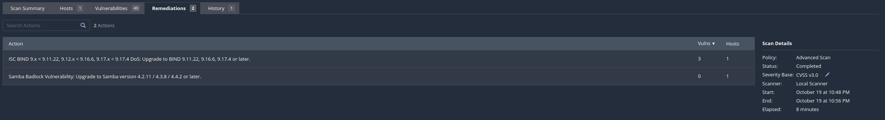

Muestra de un reporte generado como resultado de uno de los escaneos previo.

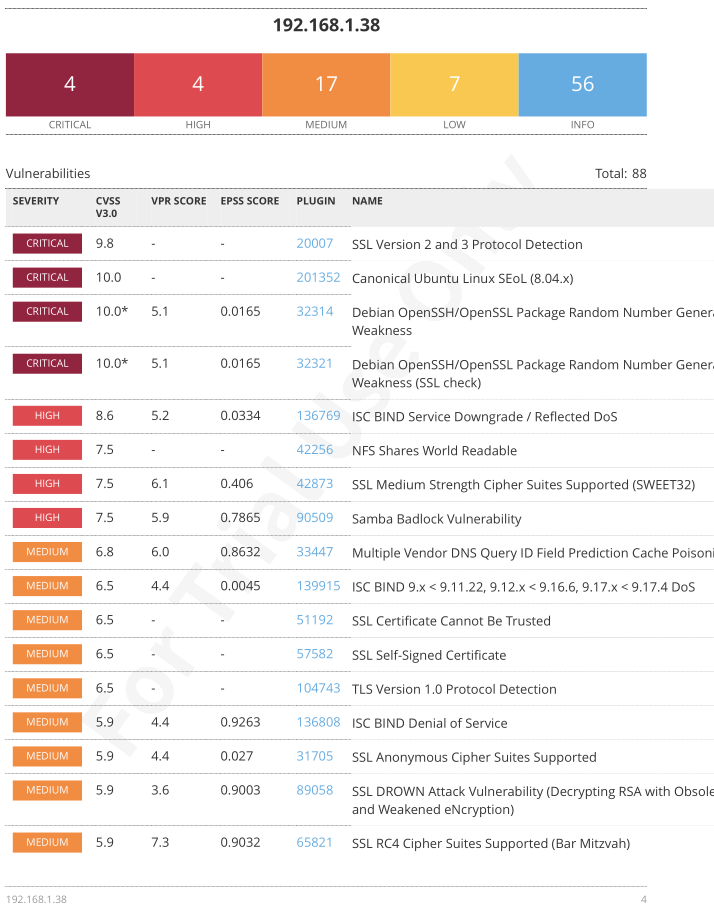

### 2\. NEXPOSE / INSIGHTVM.

**URL de descarga / sitio oficial:**
<https://www.rapid7.com/products/nexpose/>

**Tipo de herramienta:** Escáner de vulnerabilidades.

### 2.1. Descripción de la herramienta: 
Nexpose es un software de gestión de vulnerabilidades de Rapid7, diseñado para identificar, evaluar, priorizar y mitigar las debilidades de seguridad en la infraestructura de TI de una organización. Funciona mediante el escaneo de la red para encontrar vulnerabilidades, proporciona informes detallados y permite configurar políticas para asegurar el cumplimiento normativo. Su función principal es ayudar a las empresas a protegerse de ciberataques al gestionar los riesgos de manera eficiente.

### 2.2. Usos de la herramienta:

-   **Detección de vulnerabilidades:** Escanea redes, sistemas y dispositivos para encontrar fallos de seguridad, como configuraciones incorrectas o software desactualizado.

-   **Análisis de riesgos:** Evalúa el riesgo que representa cada vulnerabilidad encontrada, teniendo en cuenta exploits y el contexto de la red.

-   **Priorización de la remediación:** Permite a las empresas enfocar sus esfuerzos en solucionar primero las vulnerabilidades más críticas, lo que optimiza el proceso de corrección.

-   **Cumplimiento de políticas:** Incluye escaneo de políticas para comparar los sistemas con estándares de seguridad populares como CIS y NIST, y genera informes de remediación.

-   **Monitoreo continuo:** Supervisa las exposiciones en tiempo real y se adapta a nuevas amenazas con datos actualizados, lo que garantiza la protección constante.

-   **Generación de informes:** Proporciona informes detallados sobre las vulnerabilidades encontradas, facilitando la toma de decisiones y la comunicación con el equipo de seguridad. 

### 2.3. Cómo funciona: 
El proceso de Nexpose para escanear una red implica los siguientes pasos: 

1.  **Definir un sitio:** Se crea un \"sitio\" en Nexpose para especificar los activos que se van a escanear. Esto puede ser un rango de direcciones IP, nombres de *host* o un archivo con una lista de activos.
2.  **Configurar el escaneo:** Se establecen parámetros para el escaneo, como las credenciales para autenticarse en los sistemas (mejorando la precisión del análisis) y las plantillas de escaneo.
3.  **Ejecutar el escaneo:** Nexpose sondea los dispositivos y el software en la red para identificar los servicios activos, puertos abiertos y aplicaciones en ejecución.
4.  **Detectar vulnerabilidades:** Compara la información recolectada con su base de datos de vulnerabilidades conocidas para identificar cualquier debilidad de seguridad.
5.  **Generar un informe:** Los resultados se recopilan en un informe detallado que incluye una visión general del riesgo, la información específica de cada vulnerabilidad y los pasos de remediación recomendados.

### Ejecución de escaneo con Nexpose / InsightVM.

Para la ejecución de las pruebas de escaneo de vulnerabilidades se ha utilizado Nexpose / InsightVM instalado en una maquina virtual con Kali.

### Escenario 1. Escaneo de maquinas virtuales en red.

**Paso 1. **Definir un sitio:**** Se crea un \"sitio\" en Nexpose para ello se define un nombre, descripción y el Hostname o IP de los activos que se van a escanear.

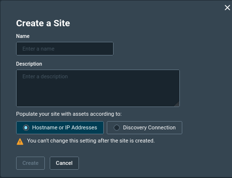

**Paso 2. **Configurar el escaneo:**** Se establecen parámetros complementarios para el escaneo (mediante las pestañas de configuración), como las credenciales para autenticarse en los sistemas (mejorando la precisión del análisis) y las plantillas de escaneo,
alertas y programación de ejecución. En este caso, tampoco se definen credenciales y se mantiene la configuración por defecto.

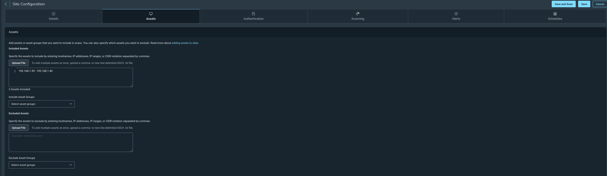

**Paso 3. ** **Ejecutar el escaneo:**** Nexpose antes de iniciar el escaneo permite definir un nombre y especificar que Assets deseo incluir en el escaneo, en este caso los 2 assets definidos en el Site previamente definido.

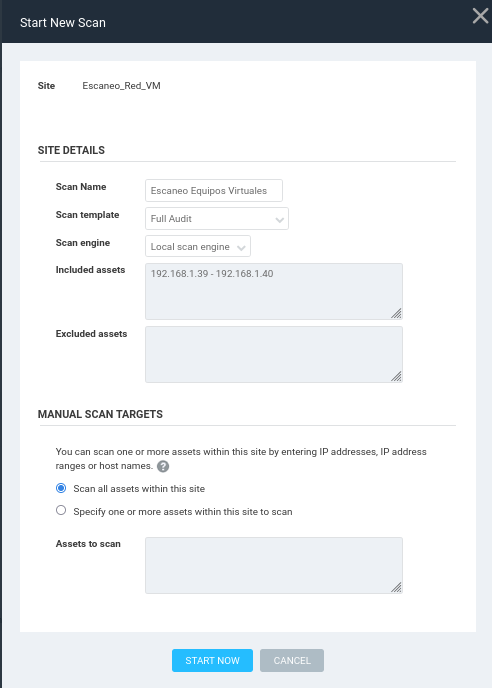

**Paso 4. Detectar vulnerabilidades:** La detección la realiza mediante la automatización de pruebas de penetración, escaneando y analizando la red en busca de puertos, aplicaciones y servicios abiertos. Una vez que los encuentra, compara sus atributos con una base de datos de vulnerabilidades conocidas para identificar debilidades y fallos de seguridad en el sistema. También evalúa políticas para detectar configuraciones que no cumplen con estándares como CIS y NIST.

**Paso 5. Generar informe:** El resultado obtenido muestra el resumen de los 2 Assets analizados (IP, nombre, sistema operativo, total de vulnerabilidades).

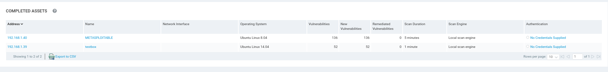

Revisando el detalle de la maquina Metasploitable se encuentra información general del equipo (versión del sistema operativo, el identificador del hardware), y lista detallada de las vulnerabilidades encontradas.

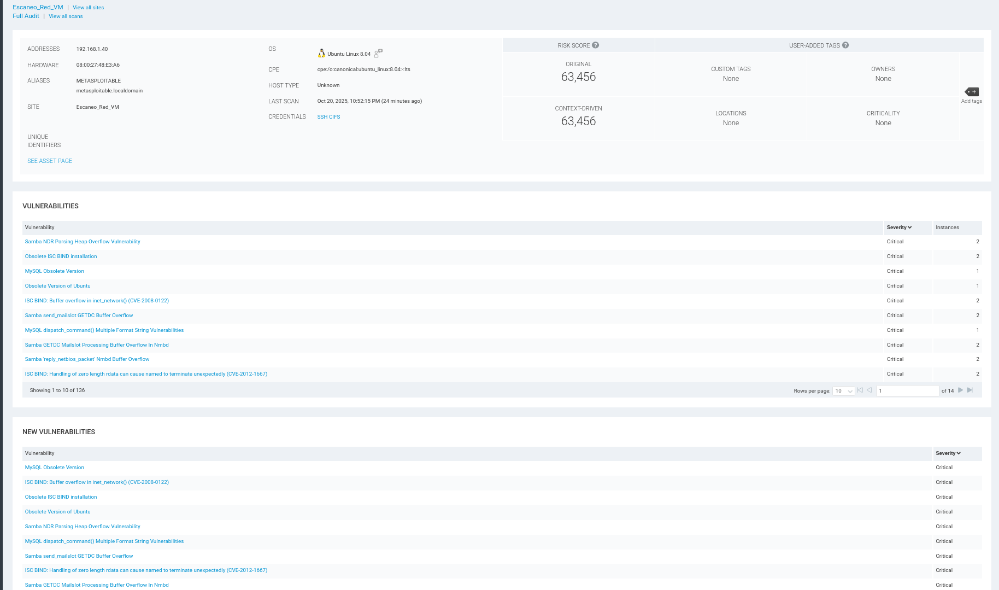

En el mismo resultado muestra información de servicios, usuarios y grupos.

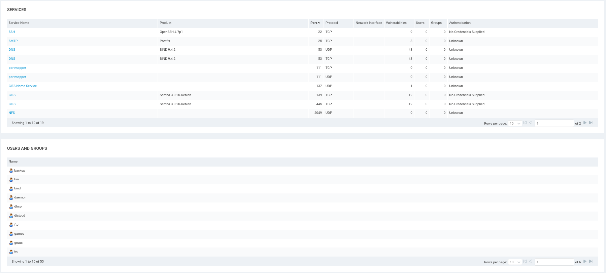

Al seleccionar una Vulnerabilidad concreta nos muestra información de la vulnerabilidad, instancias y exploits (módulos concretos para ser utilizados).

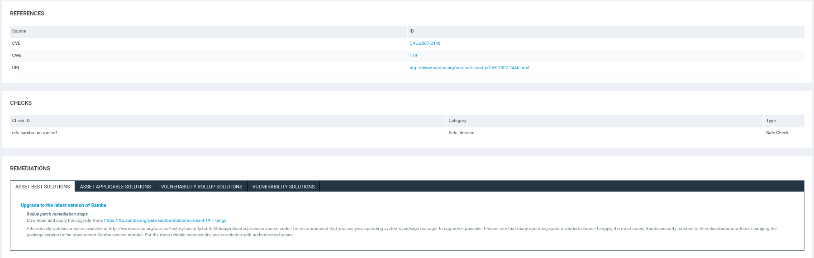

Además de referencias, checks y Remediations.

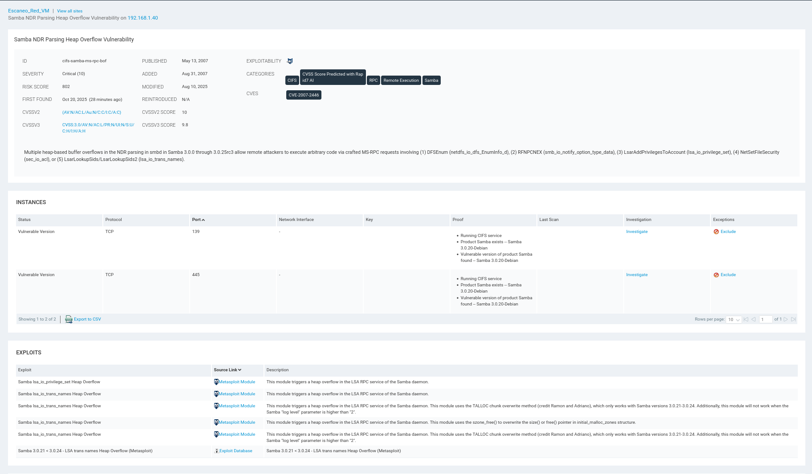

De manera complementaria permite generar reportes a partir de un escaneo previo, y el tipo de reporte (plantillas predefinidas) y el formato de salida requerido (pdf, rtf y html).

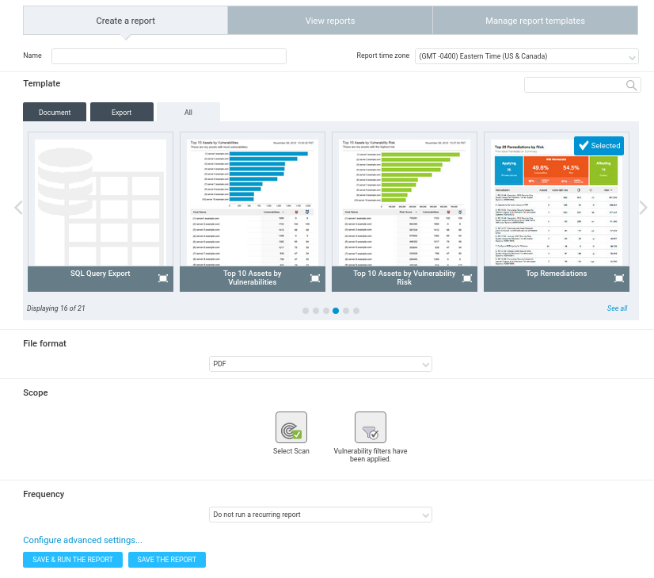

Muestra de una parte del reporte generado como resultado del escaneo previo (resumen ejecutivo).

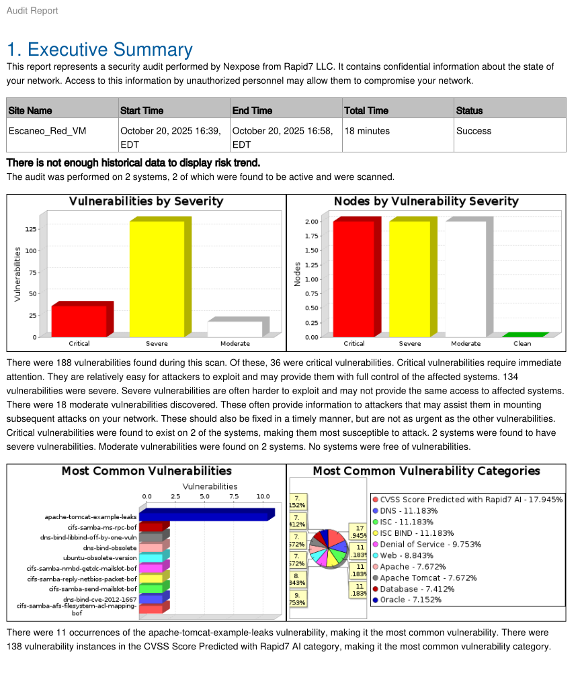

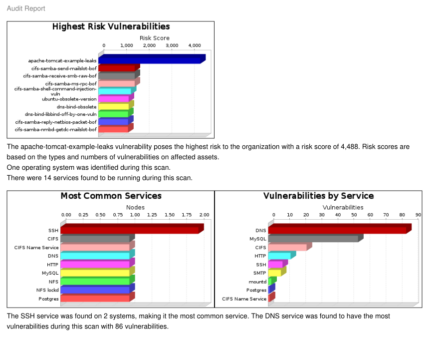

También se puede revisar el resultado obtenido del escaneo de los Assets mediante Dashboards interactivos que incluyen gráficos, visualización de tendencias, priorización por riesgo, vista de estados y remediación.

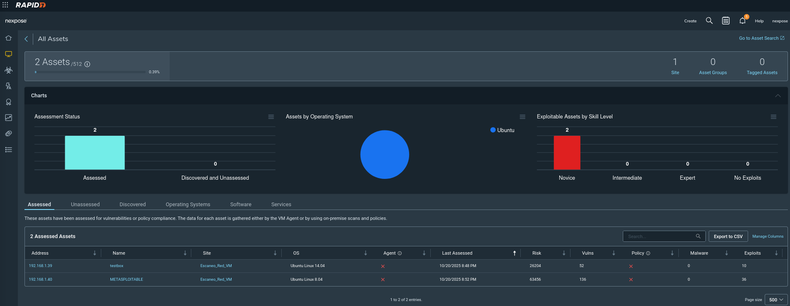

Como parte de la información detallada también se puede visualizar la información de los servicios de una maquina concreta.

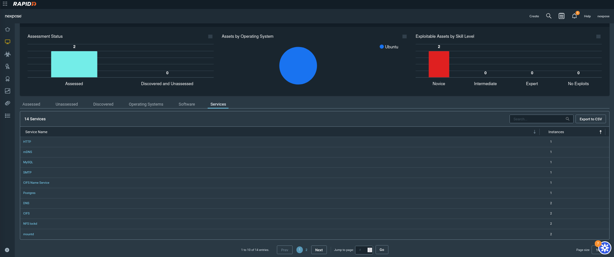

Resumen del escaneo de la red

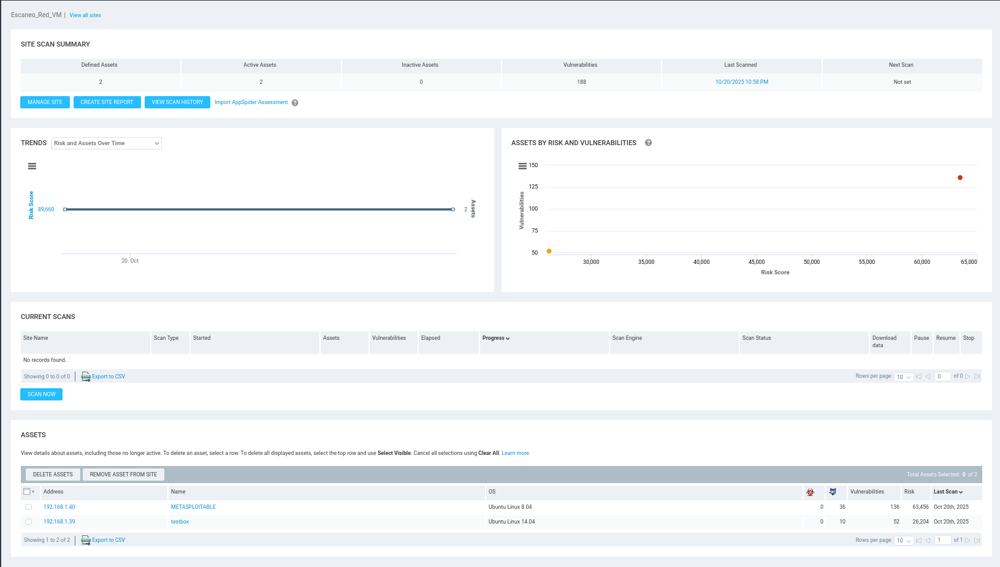

### 3. Comparativa técnica Nessus Professional vs Nexpose / InsightVM

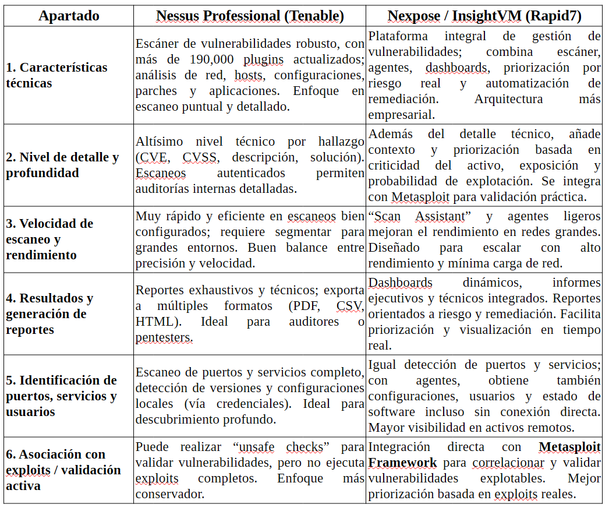

  ------------------------------------------------------------ ---------------------------------------------------------------------------------------------------------------------------------------------------------------------------------------- ------------------------------------------------------------------------------------------------------------------------------------------------------------------------------------------
  ****1. Características técnicas****                          Escáner de vulnerabilidades robusto, con más de 190,000 plugins actualizados; análisis de red, hosts, configuraciones, parches y aplicaciones. Enfoque en escaneo puntual y detallado.   Plataforma integral de gestión de vulnerabilidades; combina escáner, agentes, dashboards, priorización por riesgo real y automatización de remediación. Arquitectura más empresarial.
  ****2. Nivel de detalle y profundidad****                    Altísimo nivel técnico por hallazgo (CVE, CVSS, descripción, solución). Escaneos autenticados permiten auditorías internas detalladas.                                                   Además del detalle técnico, añade contexto y priorización basada en criticidad del activo, exposición y probabilidad de explotación. Se integra con Metasploit para validación práctica.
  ****3. Velocidad de escaneo y rendimiento****                Muy rápido y eficiente en escaneos bien configurados; requiere segmentar para grandes entornos. Buen balance entre precisión y velocidad.                                                "Scan Assistant" y agentes ligeros mejoran el rendimiento en redes grandes. Diseñado para escalar con alto rendimiento y mínima carga de red.
  ****4. Resultados y generación de reportes****               Reportes exhaustivos y técnicos; exporta a múltiples formatos (PDF, CSV, HTML). Ideal para auditores o pentesters.                                                                       Dashboards dinámicos, informes ejecutivos y técnicos integrados. Reportes orientados a riesgo y remediación. Facilita priorización y visualización en tiempo real.
  ****5. Identificación de puertos, servicios y usuarios****   Escaneo de puertos y servicios completo, detección de versiones y configuraciones locales (vía credenciales). Ideal para descubrimiento profundo.                                        Igual detección de puertos y servicios; con agentes, obtiene también configuraciones, usuarios y estado de software incluso sin conexión directa. Mayor visibilidad en activos remotos.
  ****6. Asociación con exploits / validación activa****       Puede realizar "unsafe checks" para validar vulnerabilidades, pero no ejecuta exploits completos. Enfoque más conservador.                                                               Integración directa con ****Metasploit Framework**** para correlacionar y validar vulnerabilidades explotables. Mejor priorización basada en exploits reales.
  ------------------------------------------------------------ ---------------------------------------------------------------------------------------------------------------------------------------------------------------------------------------- ------------------------------------------------------------------------------------------------------------------------------------------------------------------------------------------

### 4. Conclusión general

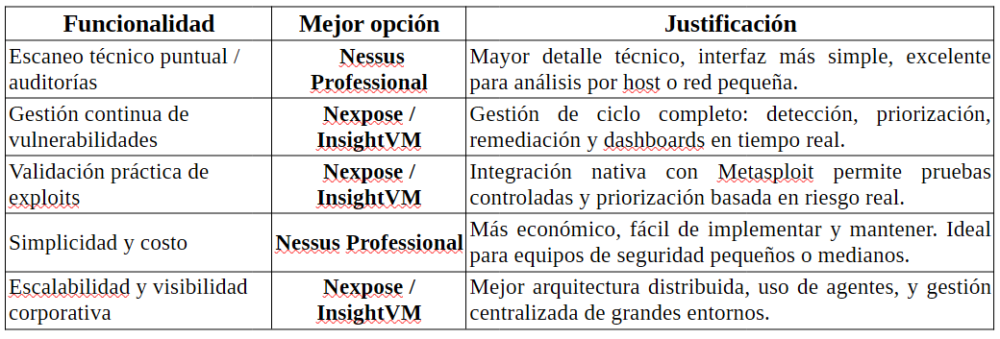

  ----------------------------------------- ----------------------------- ------------------------------------------------------------------------------------------------------
  Escaneo técnico puntual / auditorías      ****Nessus Professional****   Mayor detalle técnico, interfaz más simple, excelente para análisis por host o red pequeña.
  Gestión continua de vulnerabilidades      ****Nexpose / InsightVM****   Gestión de ciclo completo: detección, priorización, remediación y dashboards en tiempo real.
  Validación práctica de exploits           ****Nexpose / InsightVM****   Integración nativa con Metasploit permite pruebas controladas y priorización basada en riesgo real.
  Simplicidad y costo                       ****Nessus Professional****   Más económico, fácil de implementar y mantener. Ideal para equipos de seguridad pequeños o medianos.
  Escalabilidad y visibilidad corporativa   ****Nexpose / InsightVM****   Mejor arquitectura distribuida, uso de agentes, y gestión centralizada de grandes entornos.
  ----------------------------------------- ----------------------------- ------------------------------------------------------------------------------------------------------
